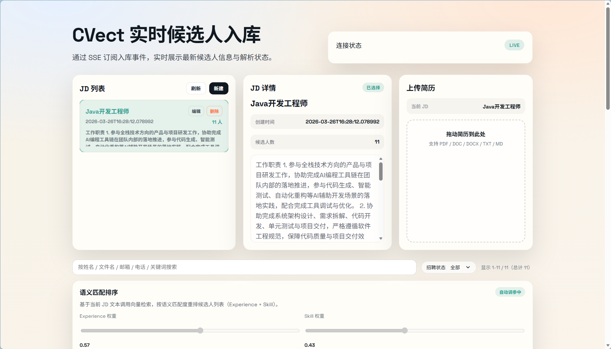

# CVect


CVect 是一个面向招聘场景的简历处理与候选人管理系统，覆盖 `JD 管理`、`简历上传解析`、`候选人列表`、`SSE 实时流` 和 `pgvector` 语义检索。

项目当前默认形态已经收敛为：

- 一个编排入口：`docker-compose.yml`
- 一个配置文件：`.env`
- 一个本地模型服务：`Qwen` CPU embedding
- 两个运行脚本：`scripts/local-run.sh`、`scripts/server-run.sh`

## Preview

<p align="center">
  
</p>

## Live Demo

| Item | Value |
| --- | --- |
| Public URL | [http://111.228.5.197:8088/](http://111.228.5.197:8088/) |
| Username | `demo` |
| Password | `demo123` |
| Access | Interviewer / demo access |

## Feature Highlights

- JD create / update / delete
- Resume upload, ZIP upload, retry, dedupe
- Tika parsing and structured extraction
- Candidate list and recruitment status updates
- SSE batch and candidate streaming
- Vector search backed by `pgvector`
- Offline Hugging Face cache for `Qwen/Qwen3-Embedding-0.6B`

## Stack

- Backend: Java 17, Spring Boot 3.5, Flyway, JPA
- Frontend: Vue 3, Vite 5
- Model service: FastAPI, Transformers, PyTorch CPU
- Database: PostgreSQL 17, `pgvector`
- Infra: Docker Compose

## Architecture

```text
frontend -> nginx -> backend -> postgres
                       |
                       -> qwen embedding service
```

## Project Layout

```text
CVect/
├── backend/cvect/        # Spring Boot backend
├── frontend/             # Vue app
├── Qwen/                 # FastAPI embedding service
├── scripts/              # run / deploy / cache scripts
├── docker-compose.yml    # single compose entry
└── .env                  # single config source
```

## Requirements

- Java 17
- Node.js 20+
- Python 3.10+
- Docker + Docker Compose

## Quick Start

### Local Development

Edit [`.env`](./.env) first, then run:

```bash
scripts/local-run.sh start
```

Useful commands:

```bash
scripts/local-run.sh status
scripts/local-run.sh stop
scripts/local-run.sh restart
```

Local mode behavior:

- `postgres` runs via Docker Compose
- `qwen` runs locally on `:8001`
- `backend` runs locally on `:8080`
- `frontend` runs locally on `:5173`
- logs and pid files are written under `.run/`

### Docker Deployment

Server mode reads the same [`.env`](./.env) and uses the same [docker-compose.yml](./docker-compose.yml).

Build and run on the target machine:

```bash
scripts/server-run.sh up
```

Useful commands:

```bash
scripts/server-run.sh status
scripts/server-run.sh logs
scripts/server-run.sh logs backend
scripts/server-run.sh down
scripts/server-run.sh restart
```

If `CVECT_EMBEDDING_SERVICE_URL` points to an external embedding service instead of `http://qwen:8001/embed`, `scripts/server-run.sh` will skip the local `qwen` container and only start `postgres/backend/frontend`.

### Offline HF Cache

The default model is `Qwen/Qwen3-Embedding-0.6B`.
The cache is prepared locally and mounted into the `qwen` container at `/root/.cache/huggingface`.

Prepare cache locally:

```bash
scripts/qwen-offline-cache.sh prefetch
scripts/qwen-offline-cache.sh verify
scripts/qwen-offline-cache.sh pack
```

Available cache commands:

```bash
scripts/qwen-offline-cache.sh info
scripts/qwen-offline-cache.sh prefetch
scripts/qwen-offline-cache.sh verify
scripts/qwen-offline-cache.sh pack
scripts/qwen-offline-cache.sh unpack /path/to/qwen-hf-cache.tgz
```

### Local Build, Server Load

If you do not want the server to build images:

1. Build locally
2. Export images
3. Upload images + HF cache + `.env`
4. Load and run on the server

Local:

```bash
docker compose --env-file .env -f docker-compose.yml build qwen backend frontend
docker pull m.daocloud.io/docker.io/pgvector/pgvector:pg17
docker save -o /tmp/cvect-images.tar \
  cvect-qwen:latest \
  cvect-backend:latest \
  cvect-frontend:latest \
  m.daocloud.io/docker.io/pgvector/pgvector:pg17
gzip -c /tmp/cvect-images.tar > .artifacts/cvect-images.tgz
scripts/qwen-offline-cache.sh pack
```

Server:

```bash
gunzip -c cvect-images.tgz | docker load
scripts/qwen-offline-cache.sh unpack /path/to/qwen-hf-cache.tgz
scripts/qwen-offline-cache.sh verify
scripts/server-run.sh up-no-build
scripts/server-run.sh status
```

Useful no-build commands:

```bash
scripts/server-run.sh up-no-build
scripts/server-run.sh restart-no-build
```

## Validation

### Health Checks

Local mode:

```bash
curl -fsS http://127.0.0.1:8001/health
curl -fsS http://127.0.0.1:8080/api/resumes/health
```

Compose / server mode:

```bash
curl -u 'demo:demo123' -fsS http://127.0.0.1:8088/healthz
docker compose --env-file .env -f docker-compose.yml ps
```

### Tests

Backend:

```bash
cd backend/cvect
./mvnw -q test
```

Frontend:

```bash
cd frontend
npm test
```

Python syntax/import checks:

```bash
python3 -m py_compile Qwen/embedding_service.py
```

## Key Configuration

Most runtime behavior is controlled from [`.env`](./.env).

Important keys:

- `CVECT_HTTP_PORT`
- `CVECT_DB_URL`
- `CVECT_DB_USERNAME`
- `CVECT_DB_PASSWORD`
- `CVECT_EMBEDDING_SERVICE_URL`
- `CVECT_EMBEDDING_API_FORMAT`
- `CVECT_EMBEDDING_HEALTH_URL`
- `CVECT_EMBEDDING_MODEL`
- `CVECT_EMBEDDING_BATCH_SIZE`
- `CVECT_EMBEDDING_MAX_INPUT_LENGTH`
- `CVECT_CHUNK_MAX_LENGTH`
- `CVECT_VECTOR_ENABLED`
- `CVECT_VECTOR_INGEST_WORKER_ENABLED`
- `CVECT_HF_CACHE_DIR`
- `CVECT_HF_HUB_OFFLINE`
- `CVECT_HF_LOCAL_FILES_ONLY`
- `JAVA_OPTS`

Small machine defaults are already tuned for `2C4G`:

- CPU-only embedding
- batch size `1`
- max input length `1024`
- conservative JVM memory

## Deployment Notes

- Live demo URL can be linked from the GitHub repository "About" section.
- The default deployment is single-node.
- `qwen` is embedding-only by default.
- Frontend auth is configured at the nginx layer and should be managed via `.env`.
- This repository is optimized for local development, demos, and single-host deployment.
